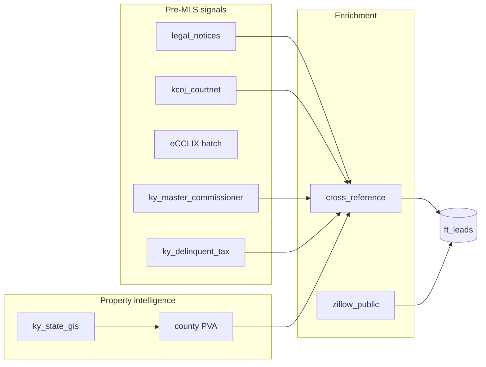

# Pre-MLS & Probate Pipeline — Foretrust KY

**Goal:** Property intelligence and owner contact data **before** a listing hits MLS — probate, foreclosure, tax distress, legal notices, and PVA-enriched parcels.

**What you have today:** ~396 leads, almost all `vacancy` from GIS + Fayette PVA. **Zero** probate / pre-foreclosure / foreclosure in DB because court and notice sources are not producing yet.

---

## Signal timeline (earliest → MLS)

| When | Source | Lead types | Status |
|------|--------|------------|--------|
| **Earliest** | Legal notices (RSS + newspapers) | `probate`, `pre_foreclosure`, `foreclosure`, `estate` | Built — needs Doppler URLs |
| **Early** | KCOJ CourtNet 3 (probate, civil foreclosure, divorce) | `probate`, `foreclosure`, `divorce` | **Broken** — UI migrated, connector stale |
| **Early** | eCCLIX (recorded wills, deeds, mortgages) | `probate`, `estate`, `foreclosure` | Built — on-demand, needs day-pass creds |
| **Mid** | Delinquent tax lists | `tax_lien` | Built — weekly cron |
| **Mid** | PVA (owner, mailing, assessed value) | enriches any type | Fayette ✅; other counties → qPublic wiring |
| **Late (still pre-MLS)** | Master Commissioner sales | `foreclosure` | Built — depends on KCOJ MC pages |
| **Late** | Zillow public records | `pre_foreclosure`, `death` | Enrichment only — needs Browserbase + addresses |
| **MLS** | Zillow/Realtor listings | — | **Out of scope** for scraper (reactive, not alpha) |

**Alpha for you:** Stages 1–4 + cross-reference (court name → PVA address + mailing).

---

## How the system is designed to work



1. **Court / notice / tax / MC** → owner name + case context (the *why*).
2. **GIS** → parcel discovery (the *where*).
3. **County PVA** → mailing address, sqft, assessed value (the *how to reach them* and *offer ceiling*).
4. **Cross-reference** (`enrich.py`) → matches normalized owner name from court to PVA record.
5. **Full Pipeline** button runs all of this in one job (`orchestrator.py`).

---

## Your three workstreams

### A. PVA feeds (property + mailing)

| County | Connector | Target URL pattern |
|--------|-----------|-------------------|
| Fayette | `fayette_pva` | fayettepva.com + Lexington ArcGIS ✅ |
| Oldham | `oldham_pva` | oldhampva.com / qPublic OldhamCountyKY (fix deployed) |
| Scott | `scott_pva` | qPublic ScottCountyKY |
| Clark | `clark_pva` | qPublic ClarkCountyKY |
| Madison | `madison_pva` | qPublic MadisonCountyKY |
| Woodford | `woodford_pva` | qPublic WoodfordCountyKY |
| Jessamine | `jessamine_pva` | qPublic JessamineCountyKY |
| Statewide fallback | `ky_state_gis` | Parcels all target counties ✅ |

**Run:** Full Pipeline (not individual PVA only) so GIS addresses flow into each county PVA with `params.addresses`.

### B. Probate (court filings)

**Primary:** `kcoj_courtnet` — daily 6am cron, searches probate (`P - Probate`) per county.

**Blocker:** CourtNet 3 at `https://kcoj.kycourts.net/kyecourts/` **redirects to `/kyecourts/Login`** — public anonymous search is gone. Legacy `#County` / `#CaseType` form no longer exists.

**Guest path (confirmed):** Register as guest → login at [KYeCourts Login](https://kcoj.kycourts.net/kyecourts/Login) → search at [CourtNet Search](https://kcoj.kycourts.net/CourtNet/Search/Index) (expect ~2 CAPTCHAs).

**Fix:**
1. Add `KCOJ_USERNAME` / `KCOJ_PASSWORD` in Doppler (`foretrust-scraper`) — your **guest** credentials.
2. Ensure `TWOCAPTCHA_API_KEY` (or CapSolver) is set — scraper solves CAPTCHAs on login + search.
3. Connector updated for `/CourtNet/Search/Index` — deploy scraper-service and trigger `kcoj_courtnet`.

**Shortcut while broken:**
- Configure **legal_notices** RSS with `"estate of"`, `"probate"`, `"letters testamentary"` + county names.
- **eCCLIX** batch when you buy a day pass — recorded wills/deeds in Scott, Clark, Madison, Woodford, Bourbon.

### C. Pre-MLS (before listing)

| Signal | Source | Action |
|--------|--------|--------|
| Estate / death of owner | Probate + legal notices + Zillow estate flag | Fix KCOJ + RSS |
| Lis pendens / pre-foreclosure | Civil cases + legal notices + Zillow | Fix KCOJ + Browserbase |
| Judicial sale scheduled | `ky_master_commissioner` | Run Mon/Wed/Fri; verify KCOJ MC URL |
| Tax delinquency 2+ years | `ky_delinquent_tax` | Already on weekly cron |
| Vacant / absentee (weaker pre-MLS) | GIS + PVA | Working — not probate but useful for NNN |

---

## What to do this week (ordered)

### You (config, ~1 hour)

```bash
# Legal notices — earliest signal
doppler secrets set GOOGLE_ALERTS_RSS_URLS="<rss1>,<rss2>" \
  --project foretrust-scraper --config prd

doppler secrets set LEGAL_NOTICE_NEWSPAPER_URLS="https://...,https://..." \
  --project foretrust-scraper --config prd

# Zillow enrichment (optional)
doppler secrets set BROWSERBASE_API_KEY="..." BROWSERBASE_PROJECT_ID="..." \
  --project foretrust-scraper --config prd

# eCCLIX when you have a day pass
doppler secrets set ECCLIX_USERNAME="..." ECCLIX_PASSWORD="..." \
  ECCLIX_COUNTIES="scott,clark,madison,woodford" \
  --project foretrust-scraper --config prd
```

Google Alerts examples:
- `"estate of" Fayette Kentucky`
- `"master commissioner" Scott County Kentucky`
- `"foreclosure" Lexington Kentucky`

### Dev (code)

1. **CourtNet 3 connector** — unblocks probate + foreclosure + divorce.
2. **qPublic PVA URLs** for Scott, Clark, Madison, Woodford, Jessamine (in progress).
3. Deploy **oldham_pva** fix.
4. Verify **ky_master_commissioner** against live KCOJ MC page after CourtNet migration.

### Ops (daily)

1. UI → **Full Pipeline** (not Type filter on Leads — that only filters DB).
2. Leads → filter `probate` / `pre_foreclosure` after sources produce.
3. **Interpret** hot leads (Gemini + Maps) for M&A scores.

---

## Success metrics

| Metric | Today | Target (30 days) |
|--------|-------|------------------|
| `probate` leads in DB | 0 | 20+ / week from KCOJ + notices |
| `pre_foreclosure` / `foreclosure` | 0 | 10+ / week from court + MC + notices |
| PVA-enriched court leads (% with mailing_address) | N/A | >50% via cross-reference |
| Counties with PVA lookup working | 1 (Fayette) | 6+ ring counties |

---

## Related docs

- `docs/SCRAPER-FIXES.md` — per-source errors and deploy steps
- `scraper-service/app/pipeline/orchestrator.py` — Full Pipeline stages
- `scraper-service/app/pipeline/enrich.py` — KCOJ ↔ PVA name matching
